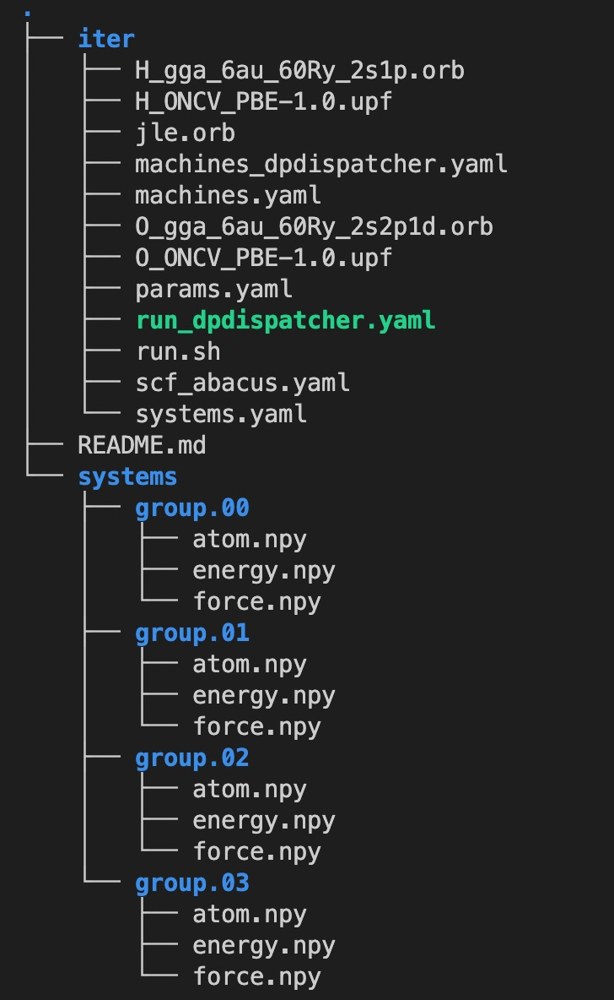

Input files preperation
=======================

To run DeePKS-kit in connection with ABACUS, a bunch of input files are required so as to iteratively perform the SCF jobs on ABACUS and the training jobs on DeePKS-kit. Here we will use **single water molecule** as an example to show the required input files for the training of an **LDA**-based DeePKS model that provides **PBE** target energies and forces. 

As can be seen in this example, 1000 structures of the single water molecules with corresponding PBE property labels (including energy and force) have been prepared in advance. Four subfolders, i.e., ``group.00-03`` and be found under the folder ``systems``: ``group.00-group.02`` contain 300 frames each and can be applied as training sets, while ``group.03`` contains 100 frames and can be applied as testing set.
The prepared file structure of a ready-to-run DeePKS iterative traning process should basically look like

scf_abacus.yaml
----------------

This file controls the SCF jobs performed in ABACUS. The ``scf_abacus`` block controls the SCF jobs after the init iteration, i.e., with DeePKS model loaded, while the ``init_scf_abacus`` controls the initial SCF jobs, i.e., bare LDA or PBE SCF calculaiton. The reason to divide this file into two blocks is that after the init iteration, the SCF calculaitons with DeePKS model loaded are sometimes found hard to converge to a tight threshold, e.g., ``scf_thr = 1e-7``. Therefore we might want to slightly loose that threshold after the init iteration.

Below is a sample ``scf_abacus.yaml`` file for single water molecule, with the explanation of each keyword. Please refer to xxx for a more detailed explanation of the input parameters in ABACUS.

.. code-block:: yaml

  scf_abacus:
    # INPUT args; keywords that related to INPUT file in ABACUS
    ntype: 2                    # int; number of different atom species in this calculations, e.g., 2 for H2O
    nbands: 8                   # int; number of bands to be calculated; optional
    ecutwfc: 50                 # real; energy cutoff, unit: Ry
    scf_thr: 1e-7               # real; SCF convergence threshold for density error; 5e-7 and below is acceptable
    scf_nmax: 50                # int; maximum SCF iteration steps
    dft_functional: "lda"       # string; name of the baseline density functional
    gamma_only: 1               # bool; 1 for gamma-only calculation
    cal_force: 1                # bool; 1 for force calculation
    cal_stress: 0               # bool; 1 for stress calculation
    deepks_descriptor_lmax: 2   # int; maximum angular momentum of the descriptor basis; 2 is recommended
    
    # STRU args; keywords that related to INPUT file in ABACUS
    # below are default STRU args, users can also set them for each group in  
    # ../systems/group.xx/stru_abacus.yaml
    orb_files: ["O_gga_6au_60Ry_2s2p1d.orb", "H_gga_6au_60Ry_2s1p.orb"] # atomic orbital file list for each element; 
                                                                        # order should be consistent with that in atom.npy
    pp_files: ["O_ONCV_PBE-1.0.upf", "H_ONCV_PBE-1.0.upf"]              # pseudopotential file list for each element; 
                                                                        # order should be consistent with that in atom.npy             
    proj_file: ["jle.orb"]                                              # projector file; generated in ABACUS; see file desriptions for more details
    lattice_constant: 1                                                 # real; lattice constant
    lattice_vector: [[28, 0, 0], [0, 28, 0], [0, 0, 28]]                # [3, 3] matrix; lattice vectors
    
    # cmd args; keywords that related to running ABACUS
    run_cmd : "mpirun"                                                  # run command
    abacus_path: "/usr/local/bin/abacus"                                # ABACUS executable path
  
  # below is the init_scf_abacus block, which is basically same as above
  # the only thing is that the recommended value for scf_thr is 1e-7
  init_scf_abacus:
    orb_files: ["O_gga_6au_60Ry_2s2p1d.orb", "H_gga_6au_60Ry_2s1p.orb"]
    pp_files: ["O_ONCV_PBE-1.0.upf", "H_ONCV_PBE-1.0.upf"]
    proj_file: ["jle.orb"]
    ntype: 2
    nbands: 8
    ecutwfc: 50
    scf_thr: 1e-7
    scf_nmax: 50
    dft_functional: "lda"
    gamma_only: 1
    cal_force: 0
    deepks_descriptor_lmax: 2
    lattice_constant: 1
    lattice_vector: [[28, 0, 0], [0, 28, 0], [0, 0, 28]]
    #cmd args
    run_cmd : "mpirun"
    abacus_path: "/usr/local/bin/abacus"

machine.yaml
--------------

.. code-block:: yaml

  # this is only part of input settings. 
  # should be used together with systems.yaml and params.yaml
  scf_machine:
    group_size: 125 
    resources:
      cpus_per_task: 1 
    sub_size: 4
    dispatcher: 
      context: local
      batch: shell # set to shell to run on local machine, you can also use `slurm` or `pbs`

  train_machine: 
    dispatcher: 
      context: local
      batch: shell # same as above, use shell to run on local machine, you can also use `slurm` or `pbs`
      remote_profile: null # use lazy local
    python: "python" # use python in path
    # resources are no longer needed, and the task will use gpu automatically if there is one

  # other settings (these are default, can be omitted)
  cleanup: false # whether to delete slurm and err files
  strict: true # do not allow undefined machine parameters

  #paras for abacus
  use_abacus: true # use abacus in scf calculation

machine_dpdispatcher.yaml
-------------------------
scf_machine: 
    | type: ``dict``
    | argument path: ``machine``

    resources: 
        | type: ``dict``
        | argument path: ``scf_machine/resources``
        
        cpus_per_task:
            | type: ``int``
            | argument path: ``scf_machine/resources/cpu_per_task``
            
            The number of CPUs running for a single SCF job. 
            
    dispatcher:
        | tpye: ``string``
        | argument path: ``scf_machine/dispatcher``
        
        The type of dispatcher chosen for job submission, which should be set as ``dpdispatcher`` here.
        
        The batch job system type. Option: Slurm, PBS, Lebesgue, Shell
        
    dpdispatcher_resources:
        | tpye: ``dict``
        | argument path: ``scf_machine/dpdispatcher_resources``
        
        number_node:
            | type: ``int``
            | argument path: ``scf_machine/resources/cpu_per_task``

    local_root: 
        | type: ``str`` | ``NoneType``
        | argument path: ``machine/local_root``

        The dir where the tasks and relating files locate. Typically the project dir.

    remote_root: 
        | type: ``str`` | ``NoneType``, optional
        | argument path: ``machine/remote_root``

        The dir where the tasks are executed on the remote machine. Only needed when context is not lazy-local.

    clean_asynchronously: 
        | type: ``bool``, optional, default: ``False``
        | argument path: ``machine/clean_asynchronously``

        Clean the remote directory asynchronously after the job finishes.

    Depending on the value of *context_type*, different sub args are accepted. 

    context_type:
        | type: ``str`` (flag key)
        | argument path: ``machine/context_type`` 
        | possible choices: LocalContext, LazyLocalContext, LebesgueContext, SSHContext, HDFSContext, DpCloudServerContext

        The connection used to remote machine. Option: LocalContext, SSHContext, HDFSContext, DpCloudServerContext, LazyLocalContext, LebesgueContext

    When *context_type* is set to ``LocalContext`` (or its aliases ``localcontext``, ``Local``, ``local``): 

    remote_profile: 
        | type: ``dict``, optional
        | argument path: ``machine[LocalContext]/remote_profile``

        The information used to maintain the connection with remote machine. This field is empty for this context.

    When *context_type* is set to ``LazyLocalContext`` (or its aliases ``lazylocalcontext``, ``LazyLocal``, ``lazylocal``): 

    remote_profile: 
        | type: ``dict``, optional
        | argument path: ``machine[LazyLocalContext]/remote_profile``

        The information used to maintain the connection with remote machine. This field is empty for this context.

    When *context_type* is set to ``LebesgueContext`` (or its aliases ``lebesguecontext``, ``Lebesgue``, ``lebesgue``): 

    remote_profile: 
        | type: ``dict``
        | argument path: ``machine[LebesgueContext]/remote_profile``

        The information used to maintain the connection with remote machine.

        email: 
            | type: ``str``
            | argument path: ``machine[LebesgueContext]/remote_profile/email``

            Email

        password: 
            | type: ``str``
            | argument path: ``machine[LebesgueContext]/remote_profile/password``

            Password

        program_id: 
            | type: ``int``
            | argument path: ``machine[LebesgueContext]/remote_profile/program_id``

            Program ID

        keep_backup: 
            | type: ``bool``, optional
            | argument path: ``machine[LebesgueContext]/remote_profile/keep_backup``

            keep download and upload zip

        input_data: 
            | type: ``dict``
            | argument path: ``machine[LebesgueContext]/remote_profile/input_data``

            Configuration of job

    When *context_type* is set to ``SSHContext`` (or its aliases ``sshcontext``, ``SSH``, ``ssh``): 

    remote_profile: 
        | type: ``dict``
        | argument path: ``machine[SSHContext]/remote_profile``

        The information used to maintain the connection with remote machine.

        hostname: 
            | type: ``str``
            | argument path: ``machine[SSHContext]/remote_profile/hostname``

            hostname or ip of ssh connection.

        username: 
            | type: ``str``
            | argument path: ``machine[SSHContext]/remote_profile/username``

            username of target linux system

        password: 
            | type: ``str``, optional
            | argument path: ``machine[SSHContext]/remote_profile/password``

            (deprecated) password of linux system. Please use `SSH keys <https://www.ssh.com/academy/ssh/key>`_ instead to improve security.

        port: 
            | type: ``int``, optional, default: ``22``
            | argument path: ``machine[SSHContext]/remote_profile/port``

            ssh connection port.

        key_filename: 
            | type: ``str`` | ``NoneType``, optional, default: ``None``
            | argument path: ``machine[SSHContext]/remote_profile/key_filename``

            key filename used by ssh connection. If left None, find key in ~/.ssh or use password for login

        passphrase: 
            | type: ``str`` | ``NoneType``, optional, default: ``None``
            | argument path: ``machine[SSHContext]/remote_profile/passphrase``

            passphrase of key used by ssh connection

        timeout: 
            | type: ``int``, optional, default: ``10``
            | argument path: ``machine[SSHContext]/remote_profile/timeout``

            timeout of ssh connection

        totp_secret: 
            | type: ``str`` | ``NoneType``, optional, default: ``None``
            | argument path: ``machine[SSHContext]/remote_profile/totp_secret``

            Time-based one time password secret. It should be a base32-encoded string extracted from the 2D code.

    When *context_type* is set to ``HDFSContext`` (or its aliases ``hdfscontext``, ``HDFS``, ``hdfs``): 

    remote_profile: 
        | type: ``dict``, optional
        | argument path: ``machine[HDFSContext]/remote_profile``

        The information used to maintain the connection with remote machine. This field is empty for this context.

    When *context_type* is set to ``DpCloudServerContext`` (or its aliases ``dpcloudservercontext``, ``DpCloudServer``, ``dpcloudserver``): 

    remote_profile: 
        | type: ``dict``
        | argument path: ``machine[DpCloudServerContext]/remote_profile``

        The information used to maintain the connection with remote machine.

        email: 
            | type: ``str``
            | argument path: ``machine[DpCloudServerContext]/remote_profile/email``

            Email

        password: 
            | type: ``str``
            | argument path: ``machine[DpCloudServerContext]/remote_profile/password``

            Password

        program_id: 
            | type: ``int``
            | argument path: ``machine[DpCloudServerContext]/remote_profile/program_id``

            Program ID

        keep_backup: 
            | type: ``bool``, optional
            | argument path: ``machine[DpCloudServerContext]/remote_profile/keep_backup``

            keep download and upload zip

        input_data: 
            | type: ``dict``
            | argument path: ``machine[DpCloudServerContext]/remote_profile/input_data``

            Configuration of job

params.yaml
------------

projector file
--------------

orbital files and pseudopotential files
---------------------------------------

